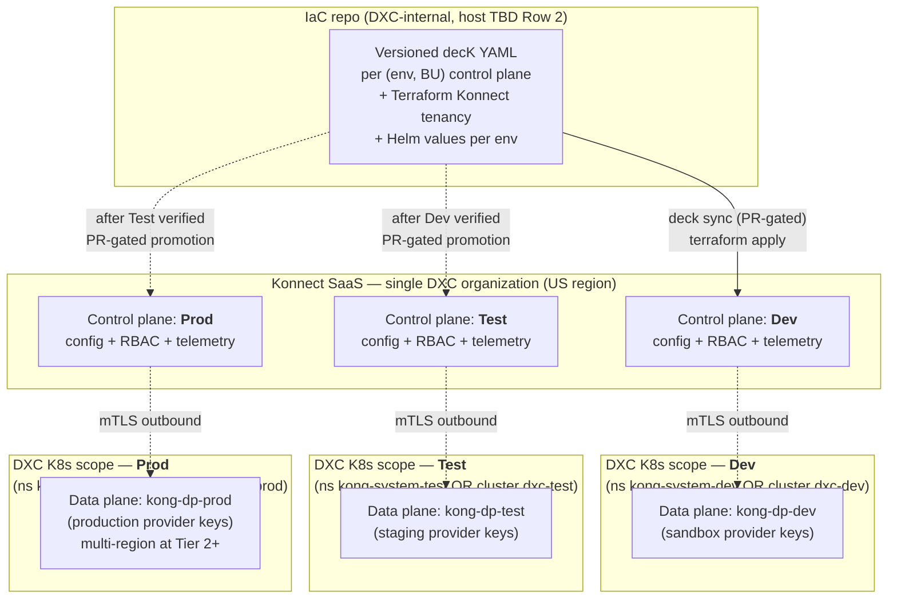

# Kong AI Gateway — K8s Deployment Diagram (data-plane tier)

**To:** DXC architecture team (primary) + Jesse / Larry / Axle (internal scoping)
**From:** Jesse Swensen (gateway owner)
**Date:** 2026-05-11 (revised 2026-05-13)
**Companion to:** the arch-team ask doc dated 2026-05-11. Every placeholder in this diagram corresponds to a row in that document.

## Changelog

- **2026-05-13** — Added View 0 (three-environment topology: Dev / Test / Prod) following Jesse's decision to lock in a standard Dev → Test → Prod tier across all phases of the gateway program. Existing Views 1 and 2 now describe the in-cluster shape **for a single environment** — that shape repeats per env. Konnect-native pattern for three environments documented as "one Konnect org with one control plane per environment" (status: open — arch team confirms as a Row 3 sub-decision). Cross-env separation, promotion gates, and namespace strategy added.
- **2026-05-11** — Initial draft. View 1 (topology) and View 2 (request path through the Recommended v1 plugin chain) produced for the arch-team package.

## How to read this

Three views in one document.

- **View 0 — Multi-environment topology.** Three Konnect control planes (Dev / Test / Prod) under a single Konnect org, with separate K8s namespace / cluster scopes per env. Promotion gates between envs. This view is **new at 2026-05-13** following Jesse's environment-tier decision.
- **View 1 — Single-environment topology.** Cluster, namespaces, pod composition, control-plane uplink, ingress, egress, secrets, observability. The picture of what's actually running **in one env**. View 1 repeats per environment shown in View 0.
- **View 2 — Request path.** A single AI request walked through the plugin chain on a route — the **Recommended v1** plugin set from Row 4 of the ask doc.

All views use the same placeholders (`<DXC-CLUSTER>`, `<DXC-INGRESS-CLASS>`, `<DXC-SECRETS-BACKEND>`, `<DXC-OBSERVABILITY-SINK>`) so the arch team can see exactly which decision unblocks which part of the picture. Mermaid renders natively on GitHub / most markdown viewers; ASCII fallback is included for plain-text contexts.

---

## View 0 — Multi-environment topology (Dev / Test / Prod)

Jesse locked in a standard three-environment tier on 2026-05-13: every workload at every phase progresses through Dev → Test → Prod under PR-gated promotion. The K8s deployment shape repeats per env; what changes between envs is **what control plane the data planes attach to**, **which secrets-backend scope is in use**, and **whether real provider keys / real traffic are in play**.



### ASCII fallback — View 0

```
+---------------------- Konnect SaaS (single DXC org) -----------------------+
|                                                                            |
|  Control plane: Dev      Control plane: Test      Control plane: Prod      |
|        ^                       ^                        ^                  |
+--------|-----------------------|------------------------|------------------+
         | deck sync             | (after Dev verified)   | (after Test verified)
         | terraform apply       | PR-gated promotion     | PR-gated promotion
         |                       |                        |
+--------+-----------------------+------------------------+------------------+
|  IaC repo (DXC-internal, host TBD Row 2)                                   |
|    decK YAML per (env, BU) control plane                                   |
|    + Terraform Konnect tenancy                                             |
|    + Helm values per env                                                   |
+----------------------------------------------------------------------------+
         |                       |                        |
         | mTLS outbound         | mTLS outbound          | mTLS outbound
         v                       v                        v
+----------------+      +----------------+       +-----------------+
| K8s scope: Dev |      | K8s scope: Test|       | K8s scope: Prod |
|  ns kong-      |      |  ns kong-      |       |  ns kong-       |
|  system-dev    |      |  system-test   |       |  system-prod    |
|  OR cluster    |      |  OR cluster    |       |  OR cluster     |
|  dxc-dev       |      |  dxc-test      |       |  dxc-prod       |
|                |      |                |       |                 |
|  data plane    |      |  data plane    |       |  data plane     |
|  (sandbox keys)|      |  (staging keys)|       |  (prod keys,    |
|                |      |                |       |   multi-region  |
|                |      |                |       |   at Tier 2+)   |
+----------------+      +----------------+       +-----------------+
```

### What to take away from View 0

- **Single Konnect organization, three control planes.** Per Kong's recommended pattern for multi-environment Konnect, one Konnect org carries three control planes — one per environment. This is the modern Kong shape that replaced "Runtime Groups" in older docs. Single billing, single audit trail, single RBAC backbone; environments stay operationally isolated because each control plane configures only its attached data planes. **Status: open — arch team confirms** as a Row 3 sub-decision.
- **K8s scope per env is a choice the platform team makes.** Two viable shapes: (a) **separate namespaces** on a single shared DXC cluster (`kong-system-dev`, `kong-system-test`, `kong-system-prod`), with network policy and RBAC enforcing the boundary; or (b) **separate clusters per environment** (`dxc-dev`, `dxc-test`, `dxc-prod`), already-standard at many DXC scopes. Option (b) is the stronger isolation story for Prod, especially when Prod goes multi-region at Tier 2. Option (a) is cheaper and the right answer if DXC's platform team already runs a single multi-tenant K8s and treats namespace-level isolation as sufficient. **Status: open — arch team confirms** as a Row 1 sub-decision. Helm values overlay and KIC scoping shape themselves around this choice.
- **Network segmentation between envs is non-negotiable.** Whichever K8s shape lands, the contract is: **no traffic flow between env scopes**. Prod data planes never reach Dev / Test upstream services or vice versa. NetworkPolicy at the namespace boundary (option a) or VPC / firewall isolation between clusters (option b). The gateway team consumes the platform team's network-segmentation story — we don't invent one.
- **Secrets backend is scoped per env.** `vault://dev/<provider>-key`, `vault://test/<provider>-key`, `vault://prod/<provider>-key` — no path collisions, no cross-env key resolution. Each env's data planes authenticate to the backend with workload identities scoped to that env. Whatever the Row 5 decision is, the vault namespace / scope per env is implied.
- **Promotion gates flow through the IaC repo.** A change merges into the Dev branch / Dev directory → CI runs `deck diff` against Dev control plane → `deck sync` on merge. The same change is then PR'd against Test → CI runs `deck diff` against Test → manual approval gate → `deck sync`. Same again for Prod. No path bypasses the IaC repo. No hand-edits in the Konnect UI in any env (Prod is the hard rule; Dev / Test are operating discipline).
- **Phase-gated traffic routing leverages this same plumbing.** Phase 1 (Discover, observe-only) lands as routes with File Log + OTel plugins only; Phase 2 (enforce on the high-risk 20%) lands as additional plugin policies on those same routes. The transition from observe-only to enforcing is a decK YAML diff promoted through Dev → Test → Prod — no re-architecture, no new infrastructure. This is the design property that makes the four-phase plan operationally cheap. See the project doc for phase definitions.

### How View 0 relates to Views 1 and 2

View 1 (single-environment topology) describes the shape inside any one of the three env scopes shown above. The pod composition, secrets sidecar, OTel collector, KIC controller decision, and egress story are identical in all three envs — only the parameters change (which provider keys, which control plane URL, which observability sink namespace). View 2 (request path) is environment-agnostic: it describes how a request traverses the plugin chain regardless of which env the route is configured in. **Phase determines what plugins are on the chain;** **env determines which control plane and which provider keys are in play.**

---

## View 1 — Single-environment topology

> **Scope of this view (revised 2026-05-13):** This diagram shows the in-cluster shape **for one environment** (any of Dev / Test / Prod from View 0). The same shape repeats per env. Differences across envs: control-plane URL, provider-key vault scope, observability sink namespace, scale (Prod multi-region from Tier 2+). Structure is identical.

```mermaid
flowchart TB
  subgraph KONNECT["Konnect SaaS (Kong-hosted control plane, US region)"]
    CP["Control plane:<br/>config + RBAC + telemetry ingest"]
  end

  subgraph DXCCLUSTER["DXC-managed K8s cluster &lt;DXC-CLUSTER&gt; (AKS / EKS / GKE / on-prem — TBD Row 1)"]
    subgraph PLATFORMNS["ns: platform-ingress (platform-team-owned, optional)"]
      ING["Ingress / LB front door<br/>class=&lt;DXC-INGRESS-CLASS&gt;"]
    end

    subgraph KONGNS["ns: kong-system (gateway tier)"]
      SVC["Service: kong-proxy<br/>(LoadBalancer or ClusterIP behind platform ingress)"]

      subgraph POD["Deployment: kong-dp (HPA-scaled, pinned 3.x)"]
        KONG["kong-gateway<br/>(data-plane, hybrid mode)"]
        OTEL["otel-collector<br/>(sidecar)"]
        VAULTAGENT["secrets sidecar<br/>(CSI driver or workload-identity helper)"]
      end

      KIC["KIC controller<br/>(optional — only if KIC-mode chosen)"]
    end

    subgraph SECRETSNS["ns: &lt;DXC-SECRETS-BACKEND&gt;-system (platform-team-owned)"]
      VAULT["Secrets backend<br/>(HashiCorp Vault / AWS SM / Azure KV — TBD Row 5)"]
    end
  end

  subgraph PROVIDERS["AI providers (public internet, egress-controlled)"]
    OAI["OpenAI"]
    ANT["Anthropic"]
    AOAI["Azure OpenAI"]
    BR["AWS Bedrock"]
  end

  subgraph OBS["Observability sink &lt;DXC-OBSERVABILITY-SINK&gt; (TBD Row 7)"]
    SINK["Datadog / Splunk / Grafana stack / Azure Monitor"]
  end

  ING -->|HTTPS| SVC
  SVC --> KONG
  KONG -.->|mTLS, outbound only<br/>config in / telemetry out| CP
  KIC -.->|reconciles CRDs<br/>(if KIC-mode)| KONG
  KONG -->|egress<br/>NetworkPolicy + allowlisted FQDNs| OAI
  KONG --> ANT
  KONG --> AOAI
  KONG --> BR
  KONG -->|vault refs resolved<br/>at runtime| VAULTAGENT
  VAULTAGENT -->|workload identity| VAULT
  KONG -->|File Log + OTel traces| OTEL
  OTEL -->|OTLP / syslog| SINK
```

### ASCII fallback — View 1

```
                       +----------------------------------+
                       | Konnect SaaS (Kong-hosted CP)    |
                       |   config + RBAC + telemetry      |
                       +----------------+-----------------+
                                        ^
                                        | mTLS, outbound only
                                        | (config in / telemetry out)
                                        |
+-----------------------------------------------------------------------+
| DXC cluster <DXC-CLUSTER>  (AKS / EKS / GKE / on-prem — Row 1)        |
|                                                                       |
|  ns: platform-ingress (optional, platform-team-owned)                 |
|  +------------------------------------------------+                   |
|  | Ingress / LB  class=<DXC-INGRESS-CLASS>        |                   |
|  +-------------------------+----------------------+                   |
|                            |                                          |
|  ns: kong-system           v                                          |
|  +-------------------------+----------------------+                   |
|  | Service: kong-proxy                            |                   |
|  +-------------------------+----------------------+                   |
|                            |                                          |
|                            v                                          |
|  +------------------------------------------------+                   |
|  | Deployment: kong-dp  (HPA-scaled, pinned 3.x)  |                   |
|  |  +-----------+  +--------------+  +---------+  |                   |
|  |  | kong-     |  | otel-        |  | secrets |  |                   |
|  |  | gateway   |  | collector    |  | sidecar |  |                   |
|  |  | (hybrid)  |  | (sidecar)    |  | (CSI/WI)|  |                   |
|  |  +-----+-----+  +------+-------+  +----+----+  |                   |
|  +--------|---------------|-----------------|------+                  |
|           |               |                 |                         |
|           |               |                 v                         |
|           |               |   +-----------------------------+         |
|           |               |   | ns: <DXC-SECRETS-BACKEND>   |         |
|           |               |   |  Vault / AWS SM / Azure KV  |         |
|           |               |   +-----------------------------+         |
|           |               |                                           |
|           |               v                                           |
|           |   +---------------------------------+                     |
|           |   | <DXC-OBSERVABILITY-SINK> (Row 7)|                     |
|           |   |  Datadog / Splunk / Grafana ... |                     |
|           |   +---------------------------------+                     |
|           |                                                           |
|           | egress (NetworkPolicy + allowlisted FQDNs)                |
|           v                                                           |
|     +------------------------------------------------+                |
|     | OpenAI | Anthropic | Azure OpenAI | Bedrock     |               |
|     +------------------------------------------------+                |
+-----------------------------------------------------------------------+
```

### What to take away from View 1

- **The data plane is the only thing we deploy into `<DXC-CLUSTER>`.** Konnect SaaS holds the control plane; the cluster runs pods. The uplink to Konnect is mTLS, outbound-only, and is the single integration with Kong-the-vendor — config flows in, telemetry flows out.
- **`kong-system` namespace is the gateway tier.** Whether the ingress sits in `kong-system` (Kong's `LoadBalancer` Service) or in a platform-team-owned `platform-ingress` namespace fronting us is parameterized as `<DXC-INGRESS-CLASS>` — decided by the platform team's existing ingress story, not by us.
- **Pod composition is deliberate:** the Kong gateway container, an OTel collector sidecar (so traces leave the pod even if the gateway restarts), and a secrets sidecar (CSI driver or workload-identity helper) so vault references resolve at runtime without secrets ever touching the YAML. KIC controller is only present in KIC-mode — otherwise decK reconciles to Konnect and the cluster never sees the config.
- **Secrets path is one-way and runtime-only.** No provider API key ever appears in decK YAML, Terraform state, or a committed file — per the hard rule in the operating contract. Vault references resolve via `<DXC-SECRETS-BACKEND>` against whatever access pattern the platform team supports (workload identity preferred).
- **Egress is constrained.** AI providers are reached over the public internet, but only via NetworkPolicy + allowlisted FQDNs. Same DXC egress story as any other outbound-internet workload — we conform to it, we don't invent one.

---

## View 2 — Request path through the Recommended v1 plugin chain

This view assumes Row 4 lands on **Recommended v1** (the ask-doc recommendation): `ai-prompt-guard` + `ai-rate-limiting-advanced` + `ai-sanitizer` (request + response) + `ai-proxy-advanced` + File Log + OTel. All plugins pinned to an exact 3.x minor release — never `latest`.

```mermaid
sequenceDiagram
  autonumber
  participant C as Client (DXC app / consumer)
  participant ING as Ingress (&lt;DXC-INGRESS-CLASS&gt;)
  participant K as Kong data plane (route on kong-system)
  participant SAN as ai-sanitizer sidecar (self-hosted)
  participant UP as Upstream AI provider
  participant V as &lt;DXC-SECRETS-BACKEND&gt;
  participant OBS as &lt;DXC-OBSERVABILITY-SINK&gt;

  C->>ING: HTTPS request (prompt body)
  ING->>K: forward to route
  Note over K: ai-prompt-guard<br/>allow/deny patterns, jailbreak filters
  Note over K: ai-rate-limiting-advanced<br/>token + request budgets per consumer
  K->>SAN: request body for PII scan
  SAN-->>K: sanitized body (PII redacted)
  Note over K: ai-proxy-advanced<br/>resolves vault ref, picks provider,<br/>shapes request to provider schema
  K->>V: resolve vault://provider-key (runtime only)
  V-->>K: API key (never logged, never persisted)
  K->>UP: provider call (OpenAI / Anthropic / Azure OpenAI / Bedrock)
  UP-->>K: completion
  K->>SAN: response body for PII scan
  SAN-->>K: sanitized response
  K->>OBS: File Log audit event (consumer, route, tokens, latency)
  K->>OBS: OTel span (trace + token-usage metric)
  K-->>ING: response
  ING-->>C: response
```

### ASCII fallback — View 2

```
Client                                                                  AI Provider
  |                                                                          ^
  | HTTPS                                                                    |
  v                                                                          |
Ingress (<DXC-INGRESS-CLASS>)                                                |
  |                                                                          |
  v                                                                          |
+--------------------------- Kong data plane (route) ----------------------+ |
|                                                                          | |
|  [1] ai-prompt-guard      -> allow/deny patterns, jailbreak filters      | |
|         |                                                                | |
|         v                                                                | |
|  [2] ai-rate-limiting-adv -> token + request budgets per consumer        | |
|         |                                                                | |
|         v                                                                | |
|  [3] ai-sanitizer (req)   -> PII scan via self-hosted sidecar -----+     | |
|         |                                                          |     | |
|         |                                          (sanitized) <---+     | |
|         v                                                                | |
|  [4] ai-proxy-advanced    -> vault ref resolved at runtime               | |
|         |                    provider selected + request shaped --------+
|         |                                                                |
|         |   provider response                                            |
|         v                                                                |
|  [5] ai-sanitizer (resp)  -> PII scan on completion --------------+      |
|         |                                                         |      |
|         |                                         (sanitized) <---+      |
|         v                                                                |
|  [6] File Log + OTel      -> audit event + trace + token-usage metric    |
|         |                       (ship to <DXC-OBSERVABILITY-SINK>)       |
+---------|----------------------------------------------------------------+
          v
       Response to client
```

### What to take away from View 2

- **Order is load-bearing.** Prompt-guard runs before rate-limiting so policy-violating prompts don't burn a consumer's token budget. Sanitizer wraps the proxy — request-side redaction means PII never reaches the upstream provider; response-side redaction means PII never reaches the client even if the provider regurgitates it. Reordering these has policy consequences, not just performance ones.
- **`ai-sanitizer` runs as a self-hostable sidecar.** Prompt content does not leave the regulated environment for redaction. This is the architectural reason it's in v1 rather than v2 — see Row 4 / Row 6 of the ask doc. If Row 6 lands "no regulated traffic on day one," the fallback chain drops the two sanitizer steps and goes `ai-prompt-guard` → `ai-rate-limiting-advanced` → `ai-proxy-advanced` → File Log + OTel. See **Anomalies** below.
- **The vault reference resolves at runtime, inside `ai-proxy-advanced`.** No provider API key is ever materialized into decK YAML, Terraform state, or any artifact in the IaC repo. The secrets sidecar from View 1 is what makes step 4 work.
- **File Log + OTel are not optional and are not deferred.** They emit on every request, success or failure. This is a hard rule from the operating contract — skipping is a P2 to back-fill, not a v2 enhancement.
- **All plugin versions are pinned.** No `latest` anywhere. Kong 3.x AI plugin behavior moved meaningfully across 3.8 / 3.10 / 3.14 — every upgrade is a re-verification event, not an automatic adoption.

---

## Anomalies and open threads

- **Konnect environment model (new 2026-05-13).** View 0 recommends one Konnect org with three control planes (Dev / Test / Prod) per Kong's published multi-environment pattern. This is the gateway-engineering recommendation but is **open — arch team confirms** as a Row 3 sub-decision. Alternatives (separate Konnect orgs per env, or tagged data plane groups within one control plane) were considered and rejected for the reasons in View 0; the arch team may reach a different conclusion based on procurement / billing / DXC-internal precedent we don't see. The diagram is structured so the env tier is independent of the BU tier — both axes are control-plane-shaped.
- **K8s cluster strategy per env (new 2026-05-13).** Two viable shapes — namespace-per-env on a shared cluster, or cluster-per-env — are both compatible with the gateway architecture. The choice is the platform team's, not gateway engineering's. **Open — arch team confirms** as a Row 1 sub-decision. The Helm values overlay structure for the IaC repo will differ between the two: namespace-per-env keeps one set of cluster-level concerns (cert-manager, ingress class) shared across envs; cluster-per-env duplicates them per env.
- **Network segmentation between envs (new 2026-05-13).** Whichever K8s shape lands, the requirement is no traffic flow between Dev / Test / Prod scopes. NetworkPolicy at namespace boundary, or VPC/firewall isolation between clusters. This is consumed from the DXC platform team's network-segmentation story.
- **Phase-gated traffic routing pattern (new 2026-05-13).** The four-phase plan (Discover → Pareto risk → Agentic → Everything else) is implemented as decK YAML deltas on existing routes, not as new infrastructure. Phase 1 routes carry File Log + OTel only; Phase 2 routes get enforcement plugins added via PR-gated `deck diff`; etc. The arch team should know this is a config-driven phase transition, not an infrastructure re-architecture between phases.
- **Row 6 (compliance) gates the sanitizer steps.** If the arch team rules `ai-sanitizer` out of scope for v1, the fallback request path is: `ai-prompt-guard` → `ai-rate-limiting-advanced` → `ai-proxy-advanced` → File Log + OTel. Steps 3 and 5 in View 2 drop; the sanitizer sidecar disappears from View 1. This is the only meaningful structural variant of the v1 picture. Document accordingly when Row 6 lands.
- **Row 1 placeholder `<DXC-CLUSTER>` covers four very different operating models.** AKS, EKS, GKE, and on-prem each shape the secrets-backend choice (Row 5) and the ingress class (`<DXC-INGRESS-CLASS>`). The diagram is correct for all four, but the Helm values overlay produced once Row 1 lands will differ per target. Not a contradiction; a flag.
- **KIC-mode vs. decK-only is not yet decided.** View 1 shows KIC as optional. If we run KIC-mode, the cluster carries Kong CRDs and KIC reconciles them; if decK-only, the cluster carries no Kong config — decK pushes to Konnect, Konnect pushes to the data plane. Both are valid; this is a downstream decision once Row 1 lands. Flagging it so the arch team sees it.
- **Consistency with the ask doc:** every plugin name, version-pinning note, and recommendation in this document matches the ask doc dated 2026-05-11 (revised 2026-05-13 for env-tier additions). No silent divergence. If a future revision of either document changes plugin scope or pinning policy, both must move together.

---

<!-- Internal references (for Jesse / Larry / Axle, not the arch team) -->
<!--
- Companion ask doc: Deliverables/2026-05-11-dxc-arch-team-ask-kong-ai-gateway.md
- Project: PKM/My Life/Projects/kong-ai-gateway.md
- Operating contract: Team/Axle - API Gateway Engineer/AGENTS.md
- Hire research (Pax): Deliverables/2026-05-11-api-gateway-engineer-hire-research.md
-->
